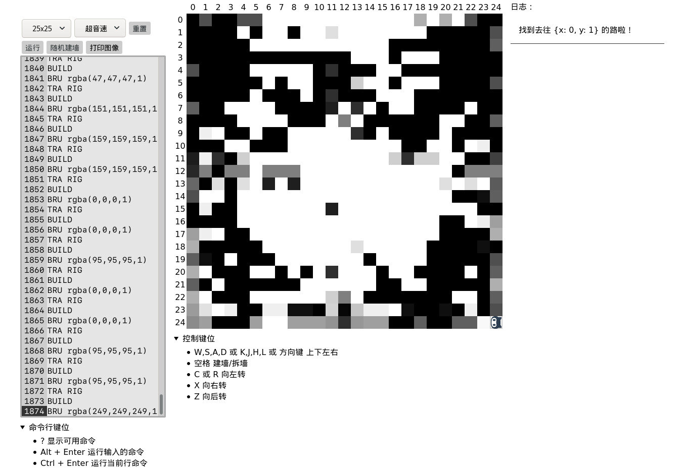

# 任务三十六：听指令的小方块（四）

## demo: [在线演示](https://evls-practices.github.io/IFE/src/2016/36/index.html)
## [ife 链接](http://ife.baidu.com/2016/task/detail?taskId=36)

<dl>
	<dt>面向人群：</dt>
	<dd>有一定JavaScript基础</dd>
	<dt>难度：</dt>
	<dd>高</dd>
</dl>

<h3>任务目的</h3>
<ul>
	<li>练习JavaScript在DOM、字符串处理相关知识</li>
	<li>利用JavaScript实践寻路相关算法</li>
</ul>

<h3>任务描述</h3>

<ul>
	<li>在输入框中允许输入如下指令，按下按钮后，使得正方形做相应动作
		<ul>
			<li>GO：向蓝色边所面向的方向前进一格（一格等同于正方形的边长）</li>
			<li>TUN LEF：向左转（逆时针旋转90度）</li>
			<li>TUN RIG：向右转（顺时针旋转90度）</li>
			<li>TUN BAC：向右转（旋转180度）</li>
		</ul>
	</li>
	<li>移动不能超出格子空间</li>
</ul>

<ul>
	<li>对于正方形的移动增加相应动画，包括移动和旋转</li>
	<li>每个指令的执行时间是1s（可以自己调整）</li>
	<li>增加新的指令如下：
		<ul>
			<li>TRA LEF：向屏幕的左侧移动一格，方向不变</li>
			<li>TRA TOP：向屏幕的上面移动一格，方向不变</li>
			<li>TRA RIG：向屏幕的右侧移动一格，方向不变</li>
			<li>TRA BOT：向屏幕的下面移动一格，方向不变</li>
			<li>MOV LEF：方向转向屏幕左侧，并向屏幕的左侧移动一格</li>
			<li>MOV TOP：方向转向屏幕上面，向屏幕的上面移动一格</li>
			<li>MOV RIG：方向转向屏幕右侧，向屏幕的右侧移动一格</li>
			<li>MOV BOT：方向转向屏幕下面，向屏幕的下面移动一格</li>
		</ul>
	</li>
</ul>

<ul>
	<li>命令输入框由input变为textarea，可以允许输入多条指令，每一行一条</li>
	<li>textarea左侧有一列可以显示当前行数的列（代码行数列），列数保持和textarea中一致</li>
	<li>当textarea发生上下滚动时，代码行数列同步滚动</li>
	<li>能够判断指令是否合法，不合法的指令给出提示</li>
	<li>点击执行时，依次逐条执行所有命令</li>
	<li>对于GO，TRA以及MOV指令增加可以移动格子数量的参数，例如
		<ul>
			<li>GO 3：向当前方向前进三格</li>
			<li>TRA TOP 2：向屏幕上方平移两格</li>
			<li>MOV RIG 4：方向转向屏幕右侧，向屏幕的右侧移动四格</li>
		</ul>
	</li>
</ul>

<ul>
	<li>新增元素“墙”，墙是正方形不可进入、越过的区域</li>
	<li>新增修墙的指令，BUILD，执行指令时，会在当前方块面对的方向前修建一格墙壁，如果被指定修墙的地方超过边界墙或者已经有墙了，则取消修墙操作，并调用浏览器的console.log方法打印一个错误日志</li>
	<li>新增粉刷的指令，BRU color，color是一个字符串，保持和css中颜色编码一致。执行指令时，如果当前方块蓝色边面对方向有紧相邻的墙，则将这个墙颜色改为参数颜色，如果没有，则通过调用浏览器的console.log方法，打印一个错误日志</li>
	<li>尝试写一段代码，实现在空间内修建一个长长的五颜六色的墙或者有趣的图形</li>
	<li>新增一个按钮，可以在空间内随机生成一些墙</li>
	<li>增加一个指令：MOV TO x, y，会使得方块从当前位置移动到坐标为x，y的地方，移动过程中不能进入墙所在的地方，寻路算法请自行选择并实现，不做具体要求</li>
</ul>

<h3>任务注意事项</h3>
<ul>
	<li>实现功能的同时，请仔细学习JavaScript相关的知识</li>
	<li>请注意代码风格的整齐、优雅</li>
	<li>代码中含有必要的注释</li>
	<li>建议不使用任何第三方库、框架</li>
	<li>寻路算法可以参考已有代码，但不建议直接引用现成的算法文件，最起码自己敲一遍</li>
	<li>有余力的同学，可以实现多种寻路算法，并在MOV TO指令中增加算法的选择功能，比如MOV TO x,y BY xxx（算法标示）</li>
</ul>

<h3>任务协作建议</h3>
<ul>
	<li>如果是各自工作，可以按以下方式：
		<ul>
			<li>团队集中讨论，明确题目要求，保证队伍各自对题目要求认知一致</li>
			<li>各自完成任务实践</li>
			<li>交叉互相Review其他人的代码，建议每个人至少看一个同组队友的代码</li>
			<li>相互讨论，最后合成一份组内最佳代码进行提交</li>
		</ul>
	</li>
	<li>如果是分工工作（推荐），可以按以下模块切分
		<ul>
			<li>墙相关的功能</li>
			<li>碰撞检测</li>
			<li>新指令的解析</li>
			<li>各种寻路算法，可以每人实现一个</li>
		</ul>
	</li>
</ul>

<h3>在线学习参考资料</h3>
<ul>
	<li>JavaScript入门篇</li>
	<li>MDN JavaScript</li>
	<li>各种寻路算法的可视化呈现</li>
</ul>
